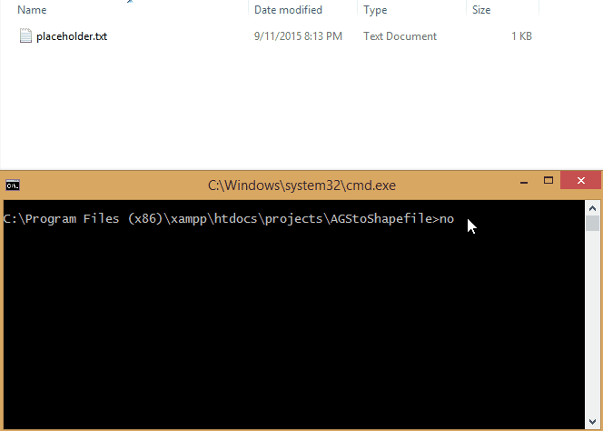

#AGStoShapefile

This node based script will convert ArcGIS Server dynamic map services (Geoservices REST API) to both a Shapefile and GeoJSON format.  This script will only export all features and is not limited to any max feature limit.  You can view more about the query interface [here](http://resources.arcgis.com/en/help/arcgis-rest-api/index.html#//02r3000000r1000000).

#Instructions
1. Updates services.txt to include the services you wish to query
* Navigate to the script directory in command line and call he script with node:

```
    // will default to [input] : services.txt and [output] : ./output/
    node AGStoSHP.js
    // optionally you can provide input and output params
    // node AGStoSHP.js [input txt file with services] [output directory]
    node AGStoSHP.js services_weather.txt ./weather_output/
```

+ Services will be saved in the output folder as a shapefile (.zip) and geojson (.geojson)

```
 for services.txt - use format [service_endpoint]|[title]
 example: http://test.service/arcigs/rest/flooding/MapServer/0|Flooding_Layer
```




